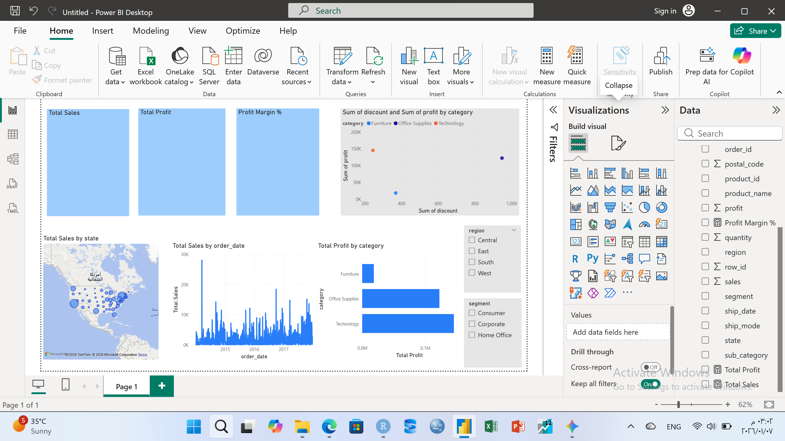

# 👉 Superstore Sales & Profitability Analysis (End-to-End)
### Bridging Statistical Computing (R) and Business Intelligence (Power BI)

## 📌 Project Overview
This project transforms raw retail data into actionable business insights. By integrating **R** for data cleaning and **Power BI** for interactive visualization, I analyzed the Global Superstore dataset to understand the relationship between sales, discounts, and net profitability.

## 🛠️ Phase 1: Data Cleaning & Wrangling (R)
Using my background in computing, I ensured the data was pristine and structured for analysis.
- **Tools:** R (Tidyverse, Janitor).
- **Tasks:** Standardizing column names, handling missing values, and formatting date sequences.

```R
library(tidyverse)
library(janitor)

# Cleaning process
> df <- read_csv("Sample Superstore.csv")

> df_final <- df %>%
+ clean names() %>%
+ mutate(order_date = as.Date(order_date, format = "%m/%d/%Y"), sales = as.numeri
c(sales), profit = as.numeric(profit), discount = as.numeric(discount)) %>%
+ drop_na(sales, profit)

> print(paste("Number of rows:", nrow(df_final)))

> head(df_final)

# Exporting for Power BI
write_excel_csv(data, "Superstore_Final_Clean.csv")


 ## 📊 Phase 2: Interactive Visual Analytics (Power BI)
​I built a dynamic dashboard to explore the data across three dimensions: Time, Geography, and Product Category.
​🔍 Key Insights:
​The Sales Spike: Identified a massive historical peak on March 14, 2014, driven by Corporate B2B bulk orders.
​Geospatial Clusters: Mapped sales density, revealing high market concentration in coastal metropolitan hubs.
​Discount vs. Profit: Used a Scatter Plot to prove that discounts exceeding 20% lead to significant profit erosion, especially in the Furniture category.
​💡 Business Recommendations
​Dynamic Pricing: Cap discounts at 15% for Furniture to protect margins.
​Inventory Focus: Prioritize Technology inventory as it yields the highest ROI.
​Expansion: Focus regional marketing on identified high-density clusters in the East Region.

### Dashboard Preview


*Figure 1: Overall performance showing the sales spike in March 2014 and regional distribution.*

### Correlation Analysis


*Figure 2: Scatter plot demonstrating the negative impact of high discounts on profit.*
